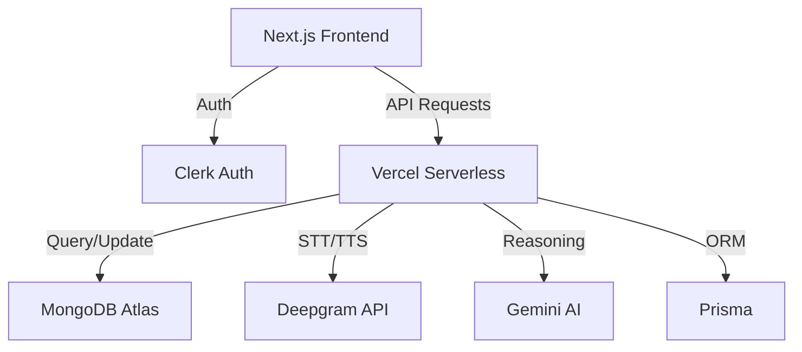

# VoiceAI SaaS

A real-time voice AI agent SaaS application built with Next.js 14+, featuring Clerk authentication, Deepgram voice processing, MongoDB database (via Prisma), and a complete credits-based payment system.

## ✨ Features

### Phase 1 - Foundation ✅
- **Dark Futuristic Aesthetic**: Premium UI with glassmorphism and neon accents
- **Responsive Design**: Mobile-first approach with Tailwind CSS v4
- **Smooth Animations**: Framer Motion for fluid interactions
- **Core Pages**: Landing, Pricing, Dashboard, Auth

### Phase 2 - Authentication ✅
- **Clerk Auth**: Modern, secure authentication with social login support
- **Protected Routes**: Middleware-based route protection
- **User Profiles**: Automatic MongoDB profile creation on first login
- **Session Management**: Secure server-side session handling via Clerk

### Phase 3 - Voice Agent ✅
- **Real-time STT**: Deepgram Nova-2 for speech-to-text
- **AI Responses**: Mock AI agent (ready for LLM integration)
- **Natural TTS**: Deepgram Aura for text-to-speech
- **Interactive Orb**: Visual feedback with 4 states (idle, listening, thinking, speaking)

### Phase 4 - SaaS Features ✅
- **Clerk Authentication**: Modern, secure login/signup with social options
- **MongoDB + Prisma**: Scalable, type-safe database for user data and history
- **Credits System**: Usage-based billing (10 credits per interaction)
- **Coupon Redemption**: Apply promo codes for bonus credits
- **Mock Payments**: Simulated Pro upgrade flow
- **Conversation History**: Track and display past conversations

---

## 💼 SaaS Analysis: Is this a viable product?

### 1. What problem does it solve?
Developing real-time voice-to-voice AI is a complex engineering challenge involving:
- Lowering latency (STT -> LLM -> TTS)
- Managing websocket connections
- Handling audio buffering and playback
- Building a scalable usage-based billing logic

**VoiceAI** solves this by providing a "Voice Infra in a Box," allowing businesses or developers to deploy a high-performance voice assistant in minutes.

### 2. How does this product solve the problem?
It integrates best-in-class providers (**Deepgram** for ultra-low latency audio and **Gemini 2.0 Flash** for fast reasoning) into a unified, premium UI. It provides all the "boring" but critical parts of a SaaS: auth, database, and credit management.

### 3. Does it save time?
**Absolutely.** Building this from scratch would take weeks of specialized engineering time. With VoiceAI, the foundation is ready in minutes.

### 4. Does it save money?
Yes. By using a serverless/usage-based model, there are zero upfront costs for infrastructure. Costs only scale as your user base grows.

---

## 🏗️ Software Architecture & System Design

### High-Level Architecture


---

## 🛠 Tech Stack

- **Framework**: Next.js 14/15/16 (App Router)
- **Styling**: Tailwind CSS v4
- **Animations**: Framer Motion
- **Database**: MongoDB Atlas (via Prisma)
- **Auth**: Clerk
- **Voice**: Deepgram (STT + TTS)
- **AI**: Google Gemini 2.0 Flash
- **Icons**: Lucide React
- **Language**: TypeScript

## 🚀 Setup Instructions

### 1. Clone and Install

```bash
git clone <your-repo>
cd voice-ai-saas
npm install
```

### 2. Clerk Setup
1. Create a new Clerk application.
2. Get your `NEXT_PUBLIC_CLERK_PUBLISHABLE_KEY` and `CLERK_SECRET_KEY`.

### 3. MongoDB & Prisma Setup
1. Create a [MongoDB Atlas](https://www.mongodb.com/cloud/atlas) account and cluster.
2. Get your `DATABASE_URL`.
3. Sync your schema:
   ```bash
   npx prisma generate
   npx prisma db push
   ```

### 4. Environment Variables
Create a `.env.local` file:
```bash
# Clerk
NEXT_PUBLIC_CLERK_PUBLISHABLE_KEY=pk_test_...
CLERK_SECRET_KEY=sk_test_...

# Database
DATABASE_URL="mongodb+srv://..."

# Voice & AI
DEEPGRAM_API_KEY=your-deepgram-key
GEMINI_API_KEY=your-gemini-key
```

### 5. Run Development Server
```bash
npm run dev
```

---

## 📁 Project Structure
```
voice-ai-saas/
├── app/
│   ├── api/                       # API Routes (Voice, Payments, Coupons)
│   ├── app/                       # Main Dashboard
│   ├── pricing/                   # Pricing & Redemptions
│   └── page.tsx                   # Landing Page
├── prisma/
│   └── schema.prisma              # Database Schema
├── lib/
│   ├── db.ts                      # Prisma Client
│   ├── voice/                     # Voice Processing
│   └── ai/                        # AI Logic
```

## 💳 Credits & Pricing

- **Free Plan**: 300 credits/month
- **Pro Plan**: 5,000 credits/month ($29/month)
- **Cost**: 10 credits per voice interaction

### Sample Coupon

Try the code `CAPSTONE_KING` for 1,000 bonus credits!

## 🔐 Authentication Flow

1. User clicks "Get Started" or "Login"
2. Clerk handles auth via highly secure modals/pages
3. Secure JWT session managed by Clerk
4. Protected routes (like `/app`) redirect to home if unauthenticated
5. User profile automatically created in MongoDB on first dashboard access

## 🎙️ Voice Agent Flow

1. Click orb to start recording (turns red)
2. Speak your message
3. Click again to stop (turns purple - thinking)
4. AI processes and responds (turns green - speaking)
5. Audio plays back automatically
6. Credits deducted, history saved

## 🗄️ Database Schema

### Tables

- **profiles**: User data, subscription status, credits
- **conversations**: Conversation sessions
- **messages**: Individual messages (user + assistant)
- **coupons**: Promo codes with redemption tracking
- **user_coupons**: Redemption history

## 🚧 Future Enhancements (Phase 5)

- [ ] Admin dashboard with analytics
- [ ] Real LLM integration (Gemini/OpenAI)
- [ ] GCP voice provider option
- [ ] Real payment gateway (Razorpay)
- [ ] Advanced conversation management
- [ ] Voice cloning for Enterprise

## 📝 Notes

- **Payments**: Currently mocked for demo purposes. Ready for integration.
- **AI Logic**: Using mock responses. Replace in `lib/ai/agent.ts` with real LLM.
- **Voice Provider**: Designed for easy swap between Deepgram and GCP.

## 🌐 Deployment

Deploy to Vercel with one click:

1. Push to GitHub
2. Import to Vercel
3. Add environment variables
4. Deploy!

## 📄 License

MIT
